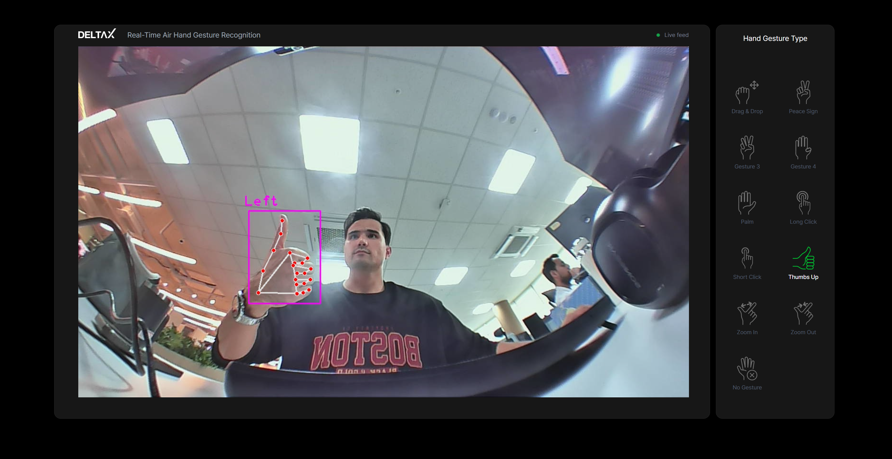

# Repo for static air hand gestures



## 1. Information
This is a ready demo for KMF-ICT EXPO on October 17, 2024. 
Can also be used for the visiting clients.  
**Anker camera** is recommended for better demo.

### 1.2. Gestures
 - Drag and drop
 - Gesture 2 - Peace sign
 - Gesture 3
 - Gesture 4
 - Gesture 5 - Palm
 - Long click
 - Short click
 - Thump up
 - Zoom in
 - Zoom out
 - No gesture

## 2. Requirements
 - mediapipe==0.9.2.1
 - numpy==1.24.2
 - opencv_python==4.8.1.78

## 3. Environment setup
 1. conda create -n gesture python=3.10
 2. conda activate gesture
 3. pip install -r requirements.txt

## 4. Usage of main branch
1. Run **all_in_one_icon_new_cam.py** for the final icon demo:
```
python all_in_one_icon_new_cam.py
```
2. Run **app.py** for the final flask demo on the web browser:
```
python app.py
```
After **app.py** is run, open http://127.0.0.1:8080/ on your local browser.

## 5. Camera parameter change
Since this demo is for Windows, the camera parameter is set as
```
cap = cv2.VideoCapture(1, cv2.CAP_DSHOW) # [0, 1, 2] for Windows
```
Make changes according to your camera ID, for example:
```
cap = cv2.VideoCapture(0) # [0, 2, 4] for Linux
```